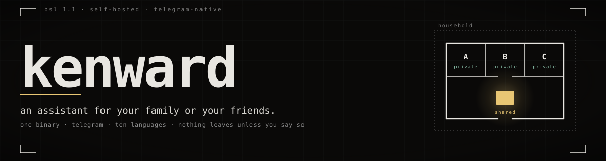

kenward is an assistant your household runs itself. It lives on a machine in your house: a
mini PC, a NAS, an LXC container, a desktop that never sleeps. Everyone talks to it in
Telegram, in their own language.

It holds what the household wants held. That Tuesday is bin day, that the boiler code is
4471, that you have been trying to stop drinking coffee after four.

Most personal assistants are built for one person on one box. Add a second person to one
of those and you get a shared brain that leaks your private context into everybody else's
conversations, or two installs that share nothing. kenward is built for the case they
miss.

There is nothing else to install. kenward imports
[lore](https://github.com/BlueHeisenberg/lore) as a Go library and creates its memory
store inside its own process, the first time it runs. `kenward setup` asks the questions.

## Two kinds of memory

**Private memory** is what the assistant knows about you: preferences, ongoing concerns,
the shape of your week.

**Shared memory** is what the household knows together: logistics, recurring plans,
decisions anybody should be able to recall.

They are separate lore spaces. Which one a conversation can reach is a property of the
conversation:

| Conversation | Reads | Writes |
| --- | --- | --- |
| Your direct chat with your own assistant | your private space, then shared | your private space |
| The household group chat | shared only | shared only |
| Your direct chat with kenward itself | shared only | shared only |

The third row exists only where every member has an agent of their own. It is how you
reach the household's memory without doing it in front of everybody.

Private conversations can read shared memory. Group conversations can never read private
memory. That is the entire point.

And you are told every time, in your own words:

> nothing is written to memory without you being told. A note to your own private memory
> is written first and then shown to you in full — the exact words and the space they went
> to — with an Undo button that removes it. Anything going to the household's shared
> memory is shown to you first and written only if you say yes, because other people will
> have read it by the time you regret it.

## Two modes, one binary

Setup asks one question about trust: *does everyone here trust whoever runs this machine
to be able to read their private conversations?* The answer picks the mode, once.

| | **Simple** | **Isolated** |
| --- | --- | --- |
| Process model | one process | one pod per member |
| Keys | one node passphrase, every member's key in one address space | one per pod, each member unlocks their own |
| Telegram | one household bot | one bot per member |
| Runs on | Windows, macOS, Linux, container | Linux with Podman or Docker |

The assistant, the memory policy and the routing are identical in both. Only the
supervisor differs.

kenward prints both statements below itself, in the setup wizard and in `kenward doctor`.
They live once, in [`internal/privacy`](internal/privacy/privacy.go), and every document
restating them is tested against it.

**Simple mode:**

> Every member's memory is separate: what you tell kenward in a private chat is stored in
> your own space, and the household group can never read it.
>
> What this mode does NOT do is seal anything against whoever runs this machine. All
> members' keys live in one process here, and one bot token carries every conversation, so
> the person operating this computer can read every member's private memory — on the disk,
> and in flight on its way to and from Telegram.

Most households are fine with that. The ones that are not have the other mode.

**Isolated mode:**

> Your assistant runs in its own process, with its own key and its own Telegram bot.
> Nobody else in the household can read your private memory, and neither can the person
> who runs this machine —
> not from the disk, not from a backup, and not before your process has been unlocked.
>
> The honest limit: kenward has to see your words in plain text to answer them, and it is
> the second member of your private space.

## Around the house

- **Reminders.** Ask for one in conversation: once, daily or weekly, at a time of day.
  It fires with exactly the text you asked for, and no model runs. Six unprompted
  messages a day, at most.
- **A quiet group chat.** In the household group kenward answers only when addressed: an
  @mention, a reply to its own message, or a slash command. Anything else costs nothing:
  no model call, no memory search.
- **Ten languages.** New members pick their language first and the model answers in it.
  kenward's own buttons, refusals and notices are written in Arabic, Catalan, Chinese,
  Dutch, English, French, German, Italian, Portuguese and Spanish.
- **An admin dashboard.** Off by default, with no port open. Turned on, it is the
  first-run wizard and then the settings screen. Loopback only until you say otherwise,
  and it will not start on the LAN without TLS.
- **Whatever machine is awake.** Endpoints are grouped into tiers, and each conversation
  names the tiers it may use, in order. kenward rotates within a tier, falls to the next
  when none answers, and skips a powered-off machine in about two seconds.

No cloud provider is configured out of the box. Adding one is a yes/no question at setup:

> A conversation whose tier chain names only machines in the house never reaches a
> provider: when none of them answers, kenward refuses rather than reaching further, and
> there is no setting that changes that.

## Getting it running

You need a Telegram bot token from [@BotFather](https://t.me/BotFather), one
OpenAI-compatible inference endpoint, and about ten minutes.

**[docs/INSTALL.md](docs/INSTALL.md)** walks both modes end to end, including the one
BotFather setting whose omission has no symptom. [The site](https://kenward.io) is the
short version; [docs/ARCHITECTURE.md](docs/ARCHITECTURE.md) is the reasoning.

Memory is [lore](https://github.com/BlueHeisenberg/lore): spaces, entries, confidence,
origin and multi-device sync, imported as a Go module rather than run as a server. kenward
owns no knowledge model of its own, membership included: in an isolated household, lore's
own grant calls admit each pod to the shared space, with nothing typed inside a container.

Mechanisms are [keel](https://github.com/BlueHeisenberg/keel): sandbox isolation, sealed
vault, model client, self-update.

## Licence

Business Source License 1.1. [LICENSE](LICENSE) has the exact terms.

Run kenward in production for yourself, your household, or inside a single organisation.
The licence gates offering kenward, or a derivative of it, to third parties as a hosted or
managed service. That needs a separate licence, so get in touch.

Each version converts to Apache 2.0 on 2030-08-14. BSL is source-available, not OSI open
source, deliberately.

